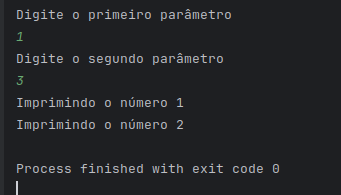
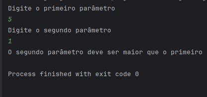

# Contador de Intervalo 📟

Este projeto foi desenvolvido como parte do **desafio de código do Bootcamp Santander na DIO (Digital Innovation One)**. Ele consiste em uma aplicação Java simples que realiza uma contagem com base em dois parâmetros fornecidos pelo usuário.

## 🧠 Descrição

O programa solicita dois números inteiros do usuário:
- O **primeiro parâmetro**
- O **segundo parâmetro**

Se o segundo número for **maior** que o primeiro, o programa realiza uma contagem do número 1 até a diferença entre os dois parâmetros. Caso contrário, uma exceção personalizada é lançada informando que o segundo número deve ser maior.

## 💻 Tecnologias Utilizadas

- Java 17 (ou superior)
- Scanner (para entrada de dados via terminal)
- Tratamento de exceções personalizado

## 📁 Estrutura do Projeto
- src/
    - dev/sylviosoares/app/
      - Contador.java
      - exception/
        - ParametrosInvalidosException.java
  - assets/
    - exemplo-de-uso.png
    - exemplo-de-uso-erro.png


## 🚀 Como Executar

1. Clone este repositório:
   ```bash
   git clone https://github.com/seu-usuario/seu-repositorio.git
    ```
   
2. Compile os arquivos .java:
    ```bash
    javac dev/sylviosoares/app/*.java dev/sylviosoares/app/exception/*.java
   ```

3. Execute a aplicação:
    ```bash
   java dev.sylviosoares.app.Contador
    ```
   
4. Insira os dois parâmetros solicitados no terminal.

## 🖼️ Exemplo de Execução

### Entrada válida:


### Parâmetro inválido:



## ⚠️ Exceções Personalizadas
O projeto utiliza a classe ParametrosInvalidosException para garantir que o segundo parâmetro seja maior que o primeiro. Caso contrário, uma mensagem de erro é exibida ao usuário.

### 👨‍💻 Autor
- Desenvolvido por Sylvio Soares
- Bootcamp Santander 2025 — Digital Innovation One